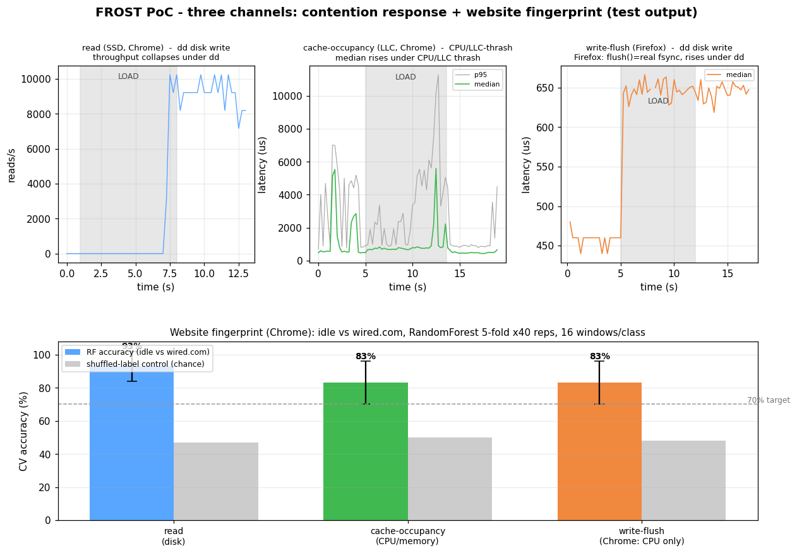

# Channel tests

End-to-end tests that drive each FROST channel in a headless browser and check it actually
works: detects contention, and fingerprints a website. They reuse the offline pipeline in
[`../analysis`](../analysis) (`dataset.py` + `features.py`) for feature extraction and the
RandomForest, so a green test here also exercises that code path.

## What they check

For one channel (`read`, `flush`, or `cache`) a single monitoring session runs two phases:

1. **Contention** - idle -> heavy load -> idle. Load is `dd ... oflag=direct` (sustained
   real SSD writes) for the SSD channels and 3 CPU/LLC-thrash tabs for cache-occupancy.
   PASS if the busy window separates from idle (throughput drop, or p95/median rise).
2. **Fingerprint** - `N_WIN` alternating idle / `nu.nl` windows, labeled. PASS if the
   RandomForest reaches **>= 70%** accuracy *and* clearly beats a **shuffled-label control**
   (the honest "chance" line). Accuracy is reported as mean +- std over 40 repeats of
   stratified CV, because a single split on a small set is meaningless.

## Run

```sh
python3 serve.py 8011 &                  # from the repo root; tests target :8011

# one channel: collect data, then analyze
SKILL=<path-to-playwright-skill>
CHANNEL=cache N_WIN=18 node "$SKILL/run.js" tests/channel_probe.js
python3 tests/analyze.py cache
```

`channel_probe.js` writes `/tmp/frost-<channel>.csv` + `-marks.json`; `analyze.py` reads
them and prints the two verdicts. Env:

- `CHANNEL` - `read` | `flush` | `cache`
- `BROWSER` - `chromium` (default) | `firefox`. **Run write-flush with `BROWSER=firefox`** -
  its `flush()` only fsyncs there (`npx playwright install firefox` first).
- `N_WIN` - windows per class (default 5; use ~18 for a trustworthy classifier number)
- `LOAD` - override the contention load: `dd` (disk) | `burn` (CPU/memory)
- `SITE`, `URL` - target site (default wired.com via the heavy path) and the PoC URL

```sh
# write-flush as a real disk channel (Firefox) vs a dd write:
BROWSER=firefox CHANNEL=flush LOAD=dd N_WIN=1 node "$SKILL/run.js" tests/channel_probe.js
python3 tests/analyze.py flush
```

## Measured results (one Linux VM, small LLC, NVMe; results are environment-specific)



Website fingerprint = idle vs **wired.com** (heavy site), 16 windows/class, RF 5-fold ×40
reps; a light site (nu.nl) sits near the noise floor for the disk channels.

| channel | browser | contention | website fingerprint |
|---------|---------|-----------|---------------------|
| **read** | Chrome | ✅ `dd` write: throughput −82…−95% | ✅ **93% ±9%** (control 47%) |
| **cache-occupancy** | Chrome | ✅ CPU/LLC-thrash: median ×4.3 | ✅ **83% ±13%** (control 50%) |
| **write-flush** | **Firefox** | ✅ `dd` write: idle flush ~480 µs, **median ×1.34** | (disk channel - fingerprint with read/cache) |
| **write-flush** | Chrome | ❌ `flush()` ~5 µs **no-op** (no fsync) | ✅ 83% but only via a faint CPU effect |

**The two takeaways:**

1. **Per resource:** `read` = disk, `cache-occupancy` = CPU/memory/website. They are not
   interchangeable - a heavy site is detected by both, a `dd` write only by `read`, a pure
   CPU/LLC thrash only by `cache`.
2. **Per browser:** `write-flush` only works where `FileSystemSyncAccessHandle.flush()` is
   a real fsync. On **Firefox** it is (idle flush ~480 µs vs Chrome's ~5 µs), so it becomes
   a genuine disk channel. On **Chrome** `flush()` is a no-op, so it senses no disk - run it
   with `BROWSER=firefox`.

Numbers vary by machine (LLC size, free RAM, SSD, OPFS quota) and browser, which is why the
tests measure rather than assume - and why cache-occupancy auto-sizes its buffer per machine.

## Files

| File | Role |
|------|------|
| `channel_probe.js` | Playwright driver: build a channel, run contention + fingerprint phases, export CSV + time-marks |
| `analyze.py` | slice the trace by marks, print contention verdict + repeated-CV classifier accuracy vs a shuffled control |
